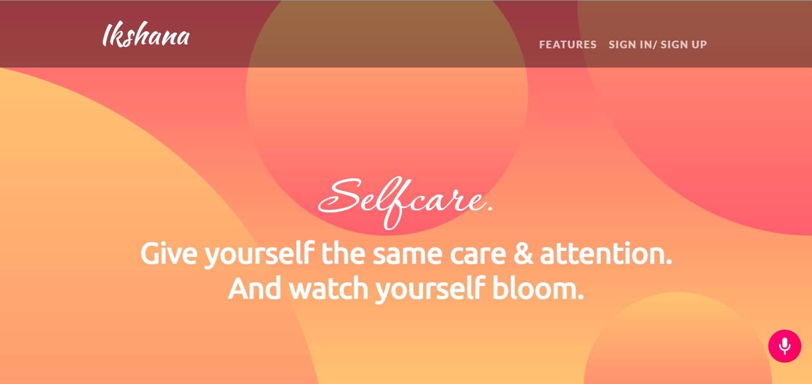
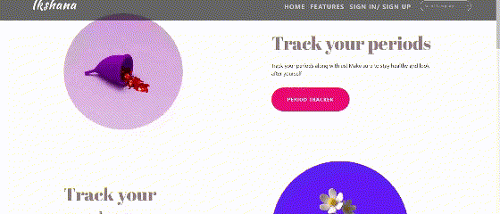
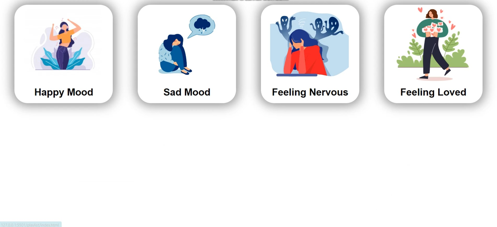

# **Ikshana**

<div align="center">
 
 
 
<br>
</div>

---
>_put ‘me-first’ and live healthier_

---
<br>

## Contents

* [Description](#Description)<br/>

* [Tech Stack](#techstack)<br/>
* [Clone and Star the Repository](#clone)<br/>
* [Demo](#demo)<br/>
* [Contributors](#contributors)

<br>

<a name="Description"></a>

# Description


Our project Ikshana is a small step towards creating an environment where gender diversity is not only about tokenism of some kind but in its true sense uplifting to the concerned.
We have tried to provide a one-stop platform for the non-male population around us who are continuously under the pressure of living upto certain standards to be respected in the society, they often forget to look after their own well being.
Our vision is to make a safe, and cosy place to learn, explore and heal themselves.

Features of Our Website:

1. Gender spectrum awareness - We have added a feature where the anyone who is still exploring their sexuality can take a quiz to know on which spectrum they incline more towards.
2. Meditation Platform - Our meditation platform helps users relax.
3. Moode Based Spotify Playlist - Our mood base player plays music based on your mood
4. Period Tracker- Our period trackers gives you an estimated date of your next cycle. It also comes in with a all you need to know to keep yourself healthy during periods guide.
5. Pregnancy Tracker- Track your pregnancy alongside us and keep yourself updated.
6. Medication Reminder- We added a feature where the user is reminded of the medications they have to take.

<br>

<a name="techstack"></a>

# Tech Stack

1. **Frontend**: JavaScript/ HTML / CSS / Bootstrap

2. **Database**: Firebase

3. **API**: Spotify / Alan / Google Translate 

<br>


<a name="clone"></a>
# Clone and Star the Repository
```
git clone https://github.com/OindrilaDas27/Ikshana.git
```

<br>

# Demo
<a name="demo"></a>

### A walkthrough of the website.
You will be greeted with a message in our homepage, from where you can either sign up/sign in or go straight to the features section:

<p align="center">
  
</p>

You can look through the various features we've provided:
<p align="center">
  
</p>

Track your periods and taker care of yourself with our all you need to know section:
<p align="center">
  
</p>

You can track your pregnancy and keep yourself updated with the pregnancy tracker:
<p align="center">
  
</p>

For those who are still exploring their sexuality, there's a quiz section in the all about pride feature:
<p align="center">
  
</p>

Make a list of your meds:
<p align="center">
  
</p>

We have added a meditation platform for users to relax and meditate:
<p align="center">
  
</p>

we also have a mood based playlist. You just need to log in through spotify and listen to the tunes based on your mood:
<p align="center">
  
</p>

<br>

# Contributors 

<a name="contributors"></a>

<a href="https://github.com/OindrilaDas27">
  
</a> <a href="https://github.com/Ayushi8989">
  
</a>

